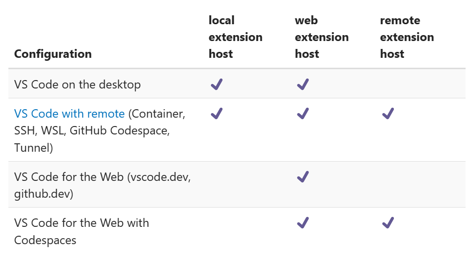

## VS Code - client/server architecture
- Graphical user interface can run inside
  - Electron app: VS Code Desktop application
  - Browser: GitHub Codespace, vscode.dev, github.dev, ...
- Backend can run inside
  - Electron app: VS Code Desktop application
  - Local WSL: WSL extension
  - Remote computer: Remote SSH extension, Tunnel extension
  - Local container: Dev Containers extension
  - Container hosted by GitHub: GitHub Codespaces
  - Browser: vscode.dev, github.dev (limited functionality)

### Example - VS Code Desktop with WSL extension

### Example - VS Code Desktop with Remote SSH extension

<!-- ## Overview - Where are the extensions running?
 -->
