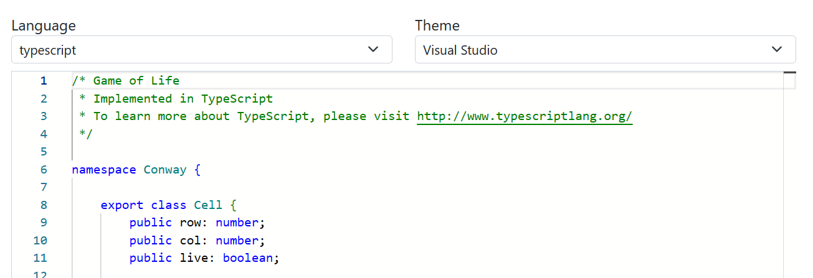

## [Erich Gamma](https://en.wikipedia.org/wiki/Erich_Gamma)

- Swiss computer scientist
- Co-author of ["Design Patterns: Elements of Reusable Object-Oriented Software"](https://en.wikipedia.org/wiki/Design_Patterns)
- Co-wrote JUnit software testing framework (which helped kickstart test-driven development)
- Lead designer of the Eclipse platform's [Java Development Tools (JDT)](https://eclipse.dev/jdt/)
- Approached by Microsoft in 2011: What can you do with coding in the browser?

## [Monaco Editor](https://microsoft.github.io/monaco-editor/)

- Lightweight code editor that runs in the browser
- Used by OneDrive, Internet Explorer F12 tools
- Early version with some thousands of users, but developers & platform not ready yet
- 2014: Pivot to desktop via node webkit => VS Code

## VS Code Desktop app

- First released in 04/2015
- Ships to Windows, Linux, macOS as Electron app (built on top of Chromium and Node.js)
  - First Microsoft tool to run on Linux
- Written in TypeScript (started around the same time)
- Only uses standard web APIs, no web frameworks
- Extensions run in separate processes, talk to the main process via remote procedure calls
- Novelty: [Language server protocol](https://microsoft.github.io/language-server-protocol/) (LSP) for language support
  - talks only about documents and position => reuse same language server between editors!
  - LSP became a standard, [supported by Visual Studio, vim, Emacs, Sublime Text, Atom, ...](https://microsoft.github.io/language-server-protocol/implementors/tools/)

## VS Code - license
- [Source code](https://github.com/microsoft/vscode) is MIT licensed (released 11/2015)
- Microsoft's VS Code distribution 
  - adds Microsoft branding
  - turns on telemetry by default
  - provides access to extensions marketplace hosted by Microsoft (some extensions are closed source)
- Alternative distributions:
    - [VSCodium](https://github.com/VSCodium/vscodium#why): desktop build without Microsoft branding & telemetry, uses [open-vsx.org marketplace](https://open-vsx.org)
    - [code-server](https://github.com/coder/code-server): VS Code in the browser built by coder.com
    - [OpenVSCode-server](https://github.com/gitpod-io/openvscode-server): VS Code in the browser built by Gitpod 
    - ...

## VS Code - the open source project
- \>10 years of development, >1M lines of code
- Thousands of issues opened every month
  - Team goal: reply within 24 hours
- Monthly release cycle

- Team (2020): 36 = 25 engineers, 6 program managers, 2 doc writers, 1 designer, 1 marketing, 1 UX researcher

- Watch later: [How we make VS Code in the open](https://www.youtube.com/watch?v=-Olo7N9xwV8)