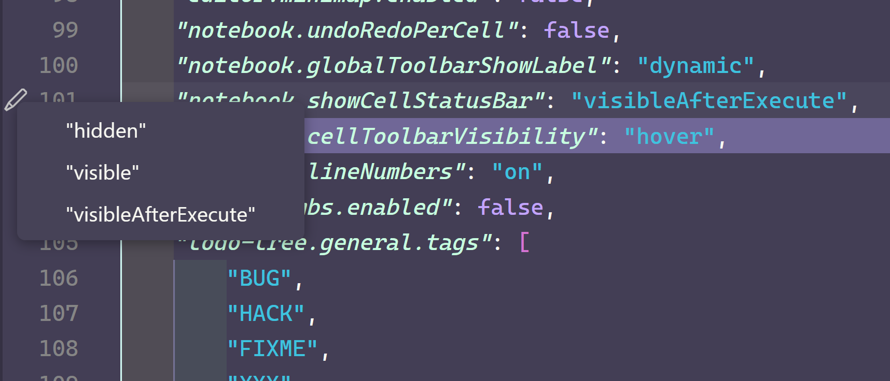

# SciPy 2023 yearbook

Sign our yearbook! Add your totally awesome team name and your favorite VS Code tip so everyone can see how cool you are 😎

## The Heisensofties: @ltalirz, @crazy4pi314, @guenp

- [Indent rainbow](https://marketplace.visualstudio.com/items?itemName=oderwat.indent-rainbow): use colors to visualize indentation levels.
- [Gremlins tracker](https://marketplace.visualstudio.com/items?itemName=nhoizey.gremlins): find that naughty Unicode dash / quote / ... character that breaks your code
- When editing VS Code settings in JSON, there is a pencil in the gutter which shows you a drop-down menu of valid setting values (if appropriate).

- The [Witch Hazel by Thea Codes](https://marketplace.visualstudio.com/items?itemName=TheaFlowers.witch-hazel) and [GitHub](https://marketplace.visualstudio.com/items?itemName=GitHub.github-vscode-theme) themes.

## @anzelpwj

- [GitLens](https://marketplace.visualstudio.com/items?itemName=eamodio.gitlens) used to be kind of a bit much when I wanted to just have a `git blame` function, but now they moved it to its own extension option and it's a lot better now.
